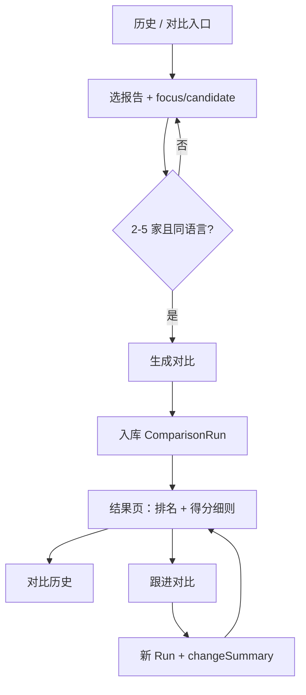

# 跨公司横向对比与决策排序 — 需求分析与实施计划

> 文档版本：**v0.3**  
> 日期：2026-06-23  
> 状态：**需求已冻结**（评审决策已录入）

---

## 0. 已确认决策（评审结论）

| # | 问题 | **结论** |
|---|------|----------|
| 1 | MVP 是否只允许 focusCompany？ | **否**。用户可自由选择 **focus 或 candidate**（同一报告内任意已分析完成的公司） |
| 2 | 单次对比上限 | **5 家** |
| 3 | 综合分权重 | **40% D1 / 30% D2 / 20% D3 / 20% D4**（服务端固定公式重算） |
| 4 | 对比结果是否入库？ | **是**。可重新打开查看；支持在同一对比会话上**跟进对比**（见 §4.3） |
| 5 | 是否允许中英文报告混比？ | **不允许**（组篮时校验 `language` 一致） |
| 6 | 排序方式 | **AI 四维打分 + 服务端固定公式**；每次输出每家公司**得分细则**（D1–D4 + composite + matchedThemes） |
| 7 | 是否过滤 Sell/Reduce？ | **不需要** |
| 8 | D4 热点缓存 TTL | 建议 **24h**（可配置 `COMPARE_HOT_TOPICS_CACHE_TTL`） |

---

## 1. 背景与目标

### 1.1 现状

系统已具备较完整的**单公司深度分析**能力，历史报告大量沉淀在 PostgreSQL（`AnalysisJob.result` → `AnalysisState` JSON）中，每条报告通常包含：

| 数据层 | 字段 / 结构 | 说明 |
|--------|-------------|------|
| 公司画像 | `CompanyAnalysis.profile` | 名称、ticker、交易所、价格、估值等快照 |
| Q&A | `CompanyAnalysis.qna[]` | 问题、检索合成答案、来源 |
| 投资论点 | `CompanyAnalysis.conclusion` | 8 个章节（含「市场预期差」）的 `summary` + `evidence[]` |
| 最终结论 | `CompanyAnalysis.finalConclusion` | 评级句 + 5–7 条 bullet（argument + evidence） |
| 元数据 | `AnalysisState.timestamp`, `query`, `language` | 报告时点、触发查询、语言 |

一份报告内除 `focusCompany` 外，还可有最多 2 家 **`candidateCompanies`**（用户点击「开始分析」且完成后才有完整 Q&A / 论点 / 结论）。

历史侧栏（`HistorySidebar`）支持按 ticker 分组、加载单份报告；已有 **ComparisonModeToggle** 仅用于**同一 ticker 的 follow-up 时间序列对比**，**不是跨公司横向对比**。

### 1.2 目标（一句话）

把历史 AI 分析从「单份可读报告」升级为**可手动组篮、多维对照、可排序、可持久化、可跟进**的决策输入，帮助用户在多个已分析标的中做**相对优先级**判断。

### 1.3 非目标（本期不做）

- 自动全库扫描、无人参与的批量 ranking
- 自动下单 / 交易执行
- 替换现有单公司分析或单公司 follow-up 流程
- 中英文报告混比
- 按评级过滤 Sell/Reduce 的开关

---

## 2. 用户故事

| ID | 角色 | 故事 | 验收标准 |
|----|------|------|----------|
| US-1 | 研究员 | 我从历史报告中勾选 2–5 家公司（focus 或 candidate），发起横向对比 | 可展开报告选具体公司；已选列表可增删；上限 5 |
| US-2 | 研究员 | 对比时能看到各公司在**报告时点**下的 Q&A、论点、最终结论 | 每列展示 snapshot 日期、公司角色（focus/candidate） |
| US-3 | 研究员 | 系统四维打分排序，并展示**每家公司得分细则** | D1–D4、composite、matchedThemes、rationale 均可见 |
| US-4 | 研究员 | 排序符合：胜率、盈利空间、错判损失、市场热点相关度 | 权重 40/30/20/20；公式可解释 |
| US-5 | 研究员 | 对比结果入库，稍后重新打开查看 | 对比历史列表；只读还原当时排名与细则 |
| US-6 | 研究员 | 对已有对比做**跟进对比** | 基于原篮子在「两次对比之间」的市场/公司变化，生成新排名 + 变化说明 |
| US-7 | 研究员 | 同一 ticker 有多份报告时，指定用哪一份 | 粒度 = **reportId × companyId** |
| US-8 | 研究员 | 不能混选中英文报告 | 组篮超 1 家时语言不一致则阻断并提示 |

---

## 3. 核心概念定义

### 3.1 对比单元（Comparison Item）

```
ComparisonItem = {
  reportId: string;           // AnalysisJob.id
  companyId: string;          // CompanyAnalysis.id（focus 或 candidate）
  companyRole: 'focus' | 'candidate';
  ticker: string;
  name: string;
  exchange: string;
  snapshotAt: string;         // 报告 timestamp
  reportLanguage: 'cn' | 'en';
}
```

**选公司规则（MVP）**：

- 打开某条历史报告 → 列出其中 **分析已完成** 的公司（`focusCompany` + 已 complete 的 `candidateCompanies`）
- 用户勾选任意组合，**不限于 focus**
- 同一 `reportId + companyId` 不可重复加入
- 组篮内所有 item 的 `reportLanguage` **必须相同**

### 3.2 四维决策框架

| 维度 | 用户表述 | 操作化定义 | 主要数据来源 |
|------|----------|------------|--------------|
| **D1 胜率 / 把握** | 投资潜在胜率、把握 | 结论可信度、证据充分度、叙事一致性、评级强度 | `finalConclusion`、bullet evidence、8 段 thesis |
| **D2 盈利空间** | 盈利空间 | 上行弹性、re-rating、预期差路径 | `ExpectationGap`、`OutlookRisks`、`MarketSentiment`、估值快照 |
| **D3 错判损失** | 判断错误时潜在损失最小 | 下行保护、安全垫（越高越好） | `Financials`、`OutlookRisks`、风险 bullet |
| **D4 市场热点相关度** | 与当前热点/板块契合度 | 与**对比发起时点**检索到的热点关联强度 | Search 热点快照 + thesis / Q&A digest |

**综合排序（固定，服务端重算）**：

```
compositeScore = (40 × D1 + 30 × D2 + 20 × D3 + 20 × D4) / 100
```

**得分细则（每次必出）**：对每家公司在 UI 与持久化 JSON 中完整保存 `dimensions`、`compositeScore`、`matchedThemes`、`rationale`、`keyStrengths`、`keyRisks`、`rank`。

### 3.3 D4 市场热点相关度 — 流程

（同 v0.2：对比发起时按 US/HK/CN Search 当前热点 → Compare LLM 评 D4 → 输出 `matchedThemes[]`）

### 3.4 时点原则

| 数据 | 时点 |
|------|------|
| D1–D3、公司 digest | 各 item **报告生成时点** |
| D4、marketHotTopics | **本次对比 Run 发起时点** |
| 跟进对比 | 新 Run 重新检索热点；可选更新公司报告引用（见 §4.3） |

UI 必须标注：`分析时点`（每公司）、`对比执行时点`（本次 Run）、`市场热点检索时点`（D4）。

---

## 4. 功能范围

### 4.1 MVP — 组篮与对比

1. **选手动篮**
   - 2–5 家公司；focus / candidate 均可
   - 语言一致性校验
   - 仅允许 `status === 'complete'` 且含可用 `finalConclusion` + `conclusion` 的公司

2. **对比执行**
   - Search 热点 → digest → Compare LLM → **服务端重算 composite** → 排名
   - 结果页：排名 + **每家得分细则** + 热点摘要 + 并排矩阵

3. **持久化（MVP 必做）**
   - 每次对比生成一条 **ComparisonRun**，归属 **ComparisonSession**
   - 首次对比创建 Session；跟进对比在同一 Session 下追加 Run

4. **API**
   - `POST /api/compare` — 新建或跟进对比
   - `GET /api/compare/sessions` — 对比历史列表
   - `GET /api/compare/sessions/:id` — Session 详情（含全部 Run）
   - `GET /api/compare/runs/:id` — 单次 Run 完整结果（只读回放）

### 4.2 MVP — 对比历史与回放

- Header / 独立入口：**对比历史**
- 列表：Session 标签、公司列表、ticker、最近 Run 时间、Top-1 公司
- 点开 Session → 时间线展示多次 Run（初次 + 跟进）
- 点开某次 Run → **只读还原**当时排名、四维分、热点快照、portfolioSummary

### 4.3 MVP — 跟进对比（Follow-up Compare）

用户对已保存的 Session 点击 **「跟进对比」**：

```
输入：
  - 原 Session 的 ComparisonItem[]（默认沿用同一 reportId + companyId）
  - 上一 Run 的 CompareResult（排名、分数、热点）
  - 本次新检索的 marketHotTopics
  - （可选）用户确认是否将各 ticker 更新为「该语言下最新已完成报告」

处理：
  1. 重新 Search 各市场热点（新 D4 基准）
  2. 若用户选择「更新报告」：同 ticker + 同 language 取最新 complete 报告替换 item（snapshotAt 变新）
     若未更新：仍用原 digest，但 LLM 需结合「距上次对比的时间间隔」做 D4 与市场语境修正
  3. Compare LLM 输入：新 digests + 新热点 + **priorRun 摘要**
  4. 输出：新 rankings + changeSummary（排名变动、分数变动、市场/公司变化要点）

输出 CompareRun：
  - parentRunId → 链式关联
  - changeSummary：相对上一 Run 的 narrative delta
```

**跟进对比 MVP 简化**：

- 默认 **沿用原 basket 的 reportId**（不自动换最新报告），避免 silently 改变用户意图
- UI 提供可选勾选：**「各公司改用最新已完成报告（同语言）」**
- `changeSummary` 必含：排名变化表、D1–D4 分数 diff、热点变化摘要

### 4.4 第二期增强

- 用户可调维度权重
- 导出 Markdown / PDF
- 对比篮模板 / 命名标签增强
- 批量「对篮内全部 ticker 发起单公司 follow-up 后再对比」

---

## 5. 架构映射

```
┌──────────────────────────────────────────────────────────────┐
│  HistorySidebar / CompareBasketPage                             │
│    选 report → 选 focus/candidate → 组篮（2–5，同语言）          │
└───────────────────────────┬──────────────────────────────────┘
                            │ POST /api/compare
                            ▼
┌──────────────────────────────────────────────────────────────┐
│  server/services/compare.ts                                   │
│    校验 language / complete / MAX=5                             │
│    加载报告 → fetchMarketHotTopics() → buildDigest()            │
│    Compare LLM（+ priorRun if follow-up）                       │
│    重算 compositeScore → 写入 ComparisonRun                     │
└───────────────────────────┬──────────────────────────────────┘
                            ▼
┌──────────────────────────────────────────────────────────────┐
│  CompareResultsPage / CompareHistoryPage                        │
│    得分细则 + 排名 + 热点 + 跟进对比按钮 + Run 时间线            │
└──────────────────────────────────────────────────────────────┘
```

---

## 6. 数据设计

### 6.1 单公司 Digest

（同 v0.2；上限改为 **5 家** × digest）

### 6.2 市场热点快照

（同 v0.2；随每次 **ComparisonRun** 持久化）

### 6.3 CompareResult（单次 Run 输出）

```typescript
interface CompareCompanyScore {
  itemId: string;
  rank: number;
  dimensions: {
    conviction: number;           // D1
    upside: number;               // D2
    downsideProtection: number;   // D3
    marketThemeFit: number;       // D4
  };
  matchedThemes: {
    theme: string;
    relevance: 'high' | 'medium' | 'low';
    reason: string;
  }[];
  compositeScore: number;         // 服务端公式重算
  rationale: string;
  keyStrengths: string[];
  keyRisks: string[];
}

interface CompareRunResult {
  runId: string;
  sessionId: string;
  parentRunId?: string;
  createdAt: string;
  items: ComparisonItem[];
  marketHotTopics: MarketHotTopicsSnapshot;
  rankings: CompareCompanyScore[];
  portfolioSummary: string;
  methodologyNote: string;       // 含权重公式说明
  changeSummary?: string;          // 跟进 Run：相对 parent 的变化
  warnings?: string[];
}
```

### 6.4 数据库 Schema（MVP 必做）

```prisma
model ComparisonSession {
  id        String          @id @default(uuid())
  label     String?         // 用户可选命名，如「存储赛道 2026-06」
  language  String          // cn | en，组篮内统一
  createdAt DateTime        @default(now())
  updatedAt DateTime        @updatedAt
  runs      ComparisonRun[]

  @@index([updatedAt])
}

model ComparisonRun {
  id              String             @id @default(uuid())
  sessionId       String
  session         ComparisonSession  @relation(fields: [sessionId], references: [id], onDelete: Cascade)
  parentRunId     String?
  parentRun       ComparisonRun?     @relation("CompareRunChain", fields: [parentRunId], references: [id])
  childRuns       ComparisonRun[]    @relation("CompareRunChain")
  createdAt       DateTime           @default(now())
  items           String             // JSON: ComparisonItem[]
  marketHotTopics String             // JSON: MarketHotTopicsSnapshot
  result          String             // JSON: rankings + portfolioSummary + ...
  digests         String?            // JSON: CompanyCompareDigest[]，可选存便于回放
  changeSummary   String?            // 跟进 Run：相对 parent 的变化 narrative

  @@index([sessionId, createdAt])
  @@index([parentRunId])
}
```

---

## 7. UX 流程



### 页面

| 页面 | 说明 |
|------|------|
| **对比篮** | 选公司、语言校验、发起对比 |
| **对比结果** | 排名、**每家 D1–D4 + composite**、热点、矩阵 |
| **对比历史** | Session 列表、Run 时间线、回放、跟进入口 |

---

## 8. API 草案

### `POST /api/compare`

**Request（首次）**

```json
{
  "items": [
    { "reportId": "uuid-1", "companyId": "focus-id" },
    { "reportId": "uuid-1", "companyId": "candidate-id" },
    { "reportId": "uuid-2", "companyId": "focus-id" }
  ],
  "language": "cn",
  "label": "可选 Session 名称"
}
```

**Request（跟进）**

```json
{
  "sessionId": "session-uuid",
  "parentRunId": "prior-run-uuid",
  "refreshReports": false
}
```

`refreshReports: true` 时，各 ticker 替换为同 language 下最新 complete 报告。

**Response**

```json
{
  "success": true,
  "sessionId": "...",
  "run": { /* CompareRunResult */ }
}
```

**错误**

- 400：items < 2 或 > 5；语言不一致
- 404：report / company / session / run 不存在
- 422：公司分析未完成

### `GET /api/compare/sessions` · `GET .../sessions/:id` · `GET .../runs/:id`

（列表 / Session+Runs / 单次 Run 回放）

### 环境变量

| 变量 | 默认 | 说明 |
|------|------|------|
| `MAX_COMPARE_ITEMS` | **5** | 单次对比上限 |
| `COMPARE_MODEL` | 同 ANALYSIS_MODEL | 对比 LLM |
| `COMPARE_SEARCH_MODEL` | 同 SEARCH_MODEL | D4 热点 Search |
| `COMPARE_HOT_TOPICS_CACHE_TTL` | 86400 | 热点缓存秒数 |

---

## 9. 实施计划

### Phase 0 — 需求冻结 ✅

- [x] focus + candidate 均可选
- [x] 上限 5 家
- [x] 权重 40/30/20/20
- [x] 入库 + 回放 + 跟进对比
- [x] 禁止混语言
- [x] AI 打分 + 固定公式 + 得分细则
- [x] 无 Sell/Reduce 过滤

### Phase 1 — 数据层（2–3 天）

| 任务 | 说明 |
|------|------|
| Prisma `ComparisonSession` / `ComparisonRun` | migration |
| `types/compare.ts` | ComparisonItem（含 companyRole）、CompareRunResult |
| `utils/compareDigest.ts` | 5 家规模 digest |
| `utils/marketHotTopics.ts` | 热点 Search |

### Phase 2 — 后端（3–4 天）

| 任务 | 说明 |
|------|------|
| `server/services/compare.ts` | 首次对比 + composite 重算 + 入库 |
| `utils/crossCompanyComparePrompt.ts` | 四维打分 + 细则 JSON schema |
| `utils/compareFollowUpPrompt.ts` | 跟进对比 + changeSummary |
| `server/routes/compare.ts` | CRUD + compare + follow-up |

### Phase 3 — 前端（4–5 天）

| 任务 | 说明 |
|------|------|
| 报告内选 focus/candidate | HistorySidebar 或 CompareBasketPage |
| CompareResultsPage | **得分细则**表格/卡片 |
| CompareHistoryPage | Session 列表 + Run 时间线 + 回放 |
| 跟进对比 UI | refreshReports 选项 + changeSummary 展示 |
| 语言校验 | 组篮时阻断混语言 |

### Phase 4 — 联调（2 天）

- [ ] 2 / 5 家；含同报告 focus+candidate 混选
- [ ] 混语言阻断
- [ ] 入库 → 回放 → 跟进 Run 全链路
- [ ] P95 延迟（5 家 + Search + LLM）

**MVP 预估**：约 **12–16 个工作日**（含持久化与跟进对比）。

---

## 10. 风险与约束

| 风险 | 缓解 |
|------|------|
| Token（5 家） | digest 压缩；上限 5 |
| 报告时点不一致 | 标注 snapshot；warnings |
| 跟进对比语义模糊 | changeSummary 结构化；可选 refreshReports |
| candidate 未分析 | 仅列 complete 公司 |
| 语言混杂 | 组篮 API + UI 双重校验 |

---

## 11. 成功指标

- 3 分钟内完成「选 5 家 → 看到排名 + **每家四维分**」
- 对比结果可 **7 天后原样回放**
- 跟进对比能说明 **排名为何变化**（市场热点 / 分数 diff）
- P95 < 60s（5 家）

---

## 12. 附录：与现有 Follow-up 对比的区别

| | 单公司 Follow-up | 跨公司对比 |
|--|------------------|------------|
| 范围 | 同一 ticker 时间链 | 多 ticker / 多报告 |
| 选公司 | 单公司 | focus **或** candidate |
| 持久化 | AnalysisJob | ComparisonSession / Run |
| 跟进 | 新分析报告 | 新 CompareRun + changeSummary |

两者互补，不互相替换。
